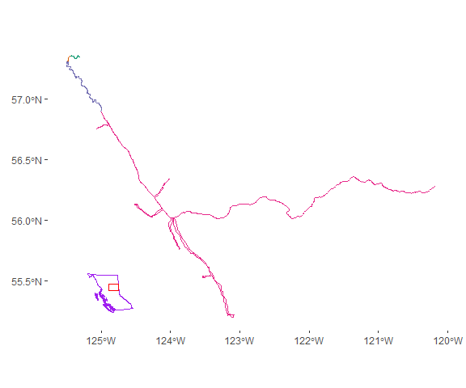
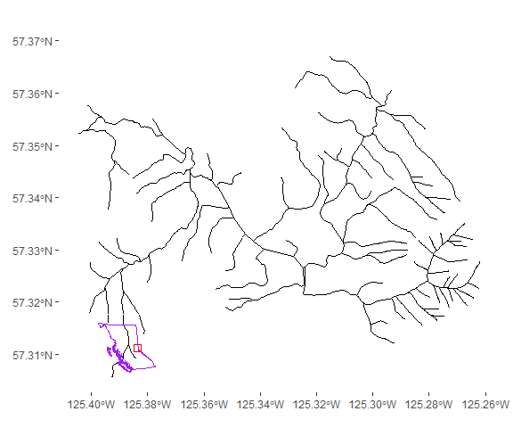
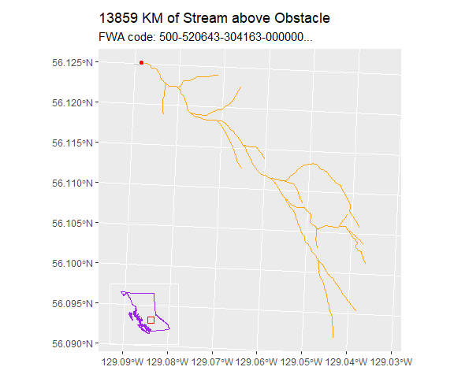

<!-- README.md is generated from README.Rmd. Please edit that file -->

# fwa.connect

<!-- badges: start -->

[](https://lifecycle.r-lib.org/articles/stages.html#experimental)
[](https://CRAN.R-project.org/package=fwa.connect)
<!-- badges: end -->

Fwa.connect is intended to help users quickly identify patterns of
connectivity between streams and lakes in the B.C. Data Catalogue’s
Freshwater Atlas (henceforth, ‘FWA’). By providing a two-column
data.table that lists up- and down-stream streams (identified by the
FWA_WATERSHED_CODE field), a tidygraph network object, and some basic
utility functions to work with upstream graphs of streams, {fwa.connect}
will hopefully reduce workflow waiting times by eliminating the need to
download the entirety of the FWA stream network or to perform laborious
spatial operations to find connections between streams.

## Installation

You can install the development version of fwa.connect like so:

``` r
devtools::install_github('chrispmad/fwa.connect')
# or 
remotes::install_github('chrispmad/fwa.connect')
```

## Functions

### Included dataset: fwa_up_and_downstream_tbl

A two-column table from which an {igraph} / {tidygraph} graph object can
be derived. The first column represents the FWA_WATERSHED_CODE
(near-unique ID column) of a target stream in the FWA
(‘upstream_fwa_code’), the second represents the FWA_WATERSHED_CODE of
the stream downstream of the target stream.

``` r
knitr::kable(head(fwa.connect::fwa_up_and_downstream_tbl, 2))
```

| upstream_fwa_code                                                                                                                               | downstream_fwa_code                                                                                                                             |
|:------------------------------------------------------------------------------------------------------------------------------------------------|:------------------------------------------------------------------------------------------------------------------------------------------------|
| 100-000025-000000-000000-000000-000000-000000-000000-000000-000000-000000-000000-000000-000000-000000-000000-000000-000000-000000-000000-000000 | 100-000000-000000-000000-000000-000000-000000-000000-000000-000000-000000-000000-000000-000000-000000-000000-000000-000000-000000-000000-000000 |
| 100-000061-000000-000000-000000-000000-000000-000000-000000-000000-000000-000000-000000-000000-000000-000000-000000-000000-000000-000000-000000 | 100-000000-000000-000000-000000-000000-000000-000000-000000-000000-000000-000000-000000-000000-000000-000000-000000-000000-000000-000000-000000 |

### fwa_graph

This function takes the included dataset described above and turns it
into a {tidygraph} graph object.

``` r
if(FALSE) fwa.connect::fwa_graph() # tbl_graph with 1523261 nodes and 1522833 edges. 
# Not sure how to display this in brief, so it's quarantined behind an 'if(FALSE)' statement for our safety!
```

### trace_course_downstream

Trace the course of flow downstream from the stream you identify with
its FWA WATERSHED CODE id. This function returns an {sf} spatial table
and an optional ggplot.

``` r
# An example FWA code.
fwa_code = "200-948755-999851-274772-093336-000000-000000-000000-000000-000000-000000-000000-000000-000000-000000-000000-000000-000000-000000-000000-000000"

ds = fwa.connect::trace_course_downstream(fwa_code = fwa_code,
                        merge_by_BLK = T,
                        make_plot = T, 
                        add_map_insert = T,
                        save_plot = F,
                        save_plot_location = NA)
#> [1] "working on stream juncture 1 of 4"
#> [1] "working on stream juncture 2 of 4"
#> [1] "working on stream juncture 3 of 4"
#> [1] "working on stream juncture 4 of 4"
#> bc_bound_hres was updated on 2023-04-11

knitr::kable(head(ds$downstream_course, 2))
```

| WATERSHED_GROUP_ID | BLUE_LINE_KEY | WATERSHED_KEY | FWA_WATERSHED_CODE                                                                                                                              | WATERSHED_GROUP_CODE | GNIS_ID | GNIS_NAME   | LEFT_RIGHT_TRIBUTARY | BLUE_LINE_KEY_50K | WATERSHED_CODE_50K                            | WATERSHED_KEY_50K | WATERSHED_GROUP_CODE_50K | GRADIENT | LENGTH_METRE | DOWNSTREAM_ROUTE_MEASURE | STREAM_MAGNITUDE | STREAM_ORDER | geometry                     |
|:-------------------|:--------------|:--------------|:------------------------------------------------------------------------------------------------------------------------------------------------|:---------------------|:--------|:------------|:---------------------|:------------------|:----------------------------------------------|:------------------|:-------------------------|:---------|-------------:|-------------------------:|-----------------:|-------------:|:-----------------------------|
| 117                | 359572348     | 359572348     | 200-948755-000000-000000-000000-000000-000000-000000-000000-000000-000000-000000-000000-000000-000000-000000-000000-000000-000000-000000-000000 | LPCE                 | 14619   | Peace River | LEFT                 | 541               | 230000000000000000000000000000000000000000000 | 541               | LPCE                     | NA       |  53153.94676 |                  1584684 |           198320 |            9 | MULTILINESTRING ((1336075 1… |
| 117                | 359572348     | 359572348     | 200-948755-000000-000000-000000-000000-000000-000000-000000-000000-000000-000000-000000-000000-000000-000000-000000-000000-000000-000000-000000 | LPCE                 | 14619   | Peace River | LEFT                 | NA                | NA                                            | NA                | NA                       | NA       |     53.26028 |                  1584865 |           157451 |            9 | LINESTRING (1324634 1253054… |

``` r

ds$plot
```



### trace_course_upstream

``` r
# An example FWA code.
fwa_code = "200-948755-999851-274772-093336-000000-000000-000000-000000-000000-000000-000000-000000-000000-000000-000000-000000-000000-000000-000000-000000"

us = fwa.connect::trace_course_upstream(fwa_code = fwa_code,
                        merge_by_BLK = T,
                        make_plot = T, 
                        add_map_insert = T,
                        save_plot = F,
                        save_plot_location = NA)
#> [1] "Merging stream geometries by BLUE_LINE_KEY and a handful of other columns."

knitr::kable(head(us$upstream_streams, 2))
```

| WATERSHED_GROUP_ID | BLUE_LINE_KEY | WATERSHED_KEY | FWA_WATERSHED_CODE                                                                                                                              | WATERSHED_GROUP_CODE | GNIS_ID | GNIS_NAME | LEFT_RIGHT_TRIBUTARY | STREAM_MAGNITUDE | BLUE_LINE_KEY_50K | WATERSHED_CODE_50K | WATERSHED_KEY_50K | WATERSHED_GROUP_CODE_50K | GRADIENT | LENGTH_METRE | DOWNSTREAM_ROUTE_MEASURE | STREAM_ORDER | geometry                     |
|-------------------:|--------------:|--------------:|:------------------------------------------------------------------------------------------------------------------------------------------------|:---------------------|:--------|:----------|:---------------------|-----------------:|------------------:|:-------------------|------------------:|:-------------------------|:---------|-------------:|-------------------------:|-------------:|:-----------------------------|
|                 50 |     359006292 |     359553059 | 200-948755-999851-274772-093336-000000-000000-000000-000000-000000-000000-000000-000000-000000-000000-000000-000000-000000-000000-000000-000000 | FINL                 | NA      | NA        | LEFT                 |                1 |                NA | NA                 |                NA | NA                       | NA       |     392.6911 |                 10.03823 |            1 | MULTILINESTRING ((1036038 1… |
|                 50 |     359033242 |     359033242 | 200-948755-999851-274772-093336-012332-516017-000000-000000-000000-000000-000000-000000-000000-000000-000000-000000-000000-000000-000000-000000 | FINL                 | NA      | NA        | RIGHT                |                1 |                NA | NA                 |                NA | NA                       | NA       |     471.3533 |                  0.00000 |            1 | LINESTRING (1036589 1373282… |

``` r

us$plot
```



### estimate_total_upstream_length

Estimate the summed lengths of all streams above a certain point in
space, e.g. a barrier to fish passage. This can be done for a single
point or for an {sf} table of multiple points.

#### Single point

``` r
# library(bcdata) # To access datasets in the open-source BC Data Catalogue
# library(sf)
# library(progress)

# Download a possible fish barrier from the PSCIS dataset.
fp = bcdata::bcdc_query_geodata("pscis-assessments") |> 
  bcdata::filter(RESPONSIBLE_PARTY_NAME == 'WEST FRASER MILLS LTD.',
         STREAM_NAME == 'Nass River',
         ROAD_NAME == 'Warren Road') |>
  bcdata::collect()

# Find the nearest stream within 50 meters.
stream = fwa.connect::find_nearest_stream(fp, max_buffer_dist = 50)

# Calculate the summed length of all streams upstream from a point (or a FWA code)
upstream_l = fwa.connect::estimate_total_upstream_length(obstacles = fp,
                                            make_plot = T,
                                            save_plot = F)
#> 1 point to assess...
```



``` r

knitr::kable(
  upstream_l 
)
```

| total_length_m | id                                                             | search_outcome               |
|---------------:|:---------------------------------------------------------------|:-----------------------------|
|          13908 | WHSE_FISH.PSCIS_ASSESSMENT_SVW.fid-3e6b80c7_18d52f29df9\_-14de | stream(s) found and measured |

#### Multiple points

``` r
# Calculate the length for multiple points.
fps = bcdata::bcdc_query_geodata("pscis-assessments") |>
  bcdata::filter(ASSESSMENT_DATE > as.Date('2020-10-01') & ASSESSMENT_DATE < as.Date('2021-01-01')) |> 
  bcdata::collect()

upstream_lengths = fwa.connect::estimate_total_upstream_length(
  obstacles = fps,
  make_plot = F,
  save_plot = F
)
#> 11 points to assess...

knitr::kable(
  upstream_lengths
)
```

| total_length_m | id                                                          | search_outcome               |
|---------------:|:------------------------------------------------------------|:-----------------------------|
|           4386 | WHSE_FISH.PSCIS_ASSESSMENT_SVW.fid-65d169d5_18d52f077c2_24a | stream(s) found and measured |
|          30012 | WHSE_FISH.PSCIS_ASSESSMENT_SVW.fid-65d169d5_18d52f077c2_24b | stream(s) found and measured |
|           8722 | WHSE_FISH.PSCIS_ASSESSMENT_SVW.fid-65d169d5_18d52f077c2_24c | stream(s) found and measured |
|           6834 | WHSE_FISH.PSCIS_ASSESSMENT_SVW.fid-65d169d5_18d52f077c2_24d | stream(s) found and measured |
|          45787 | WHSE_FISH.PSCIS_ASSESSMENT_SVW.fid-65d169d5_18d52f077c2_24e | stream(s) found and measured |
|          45787 | WHSE_FISH.PSCIS_ASSESSMENT_SVW.fid-65d169d5_18d52f077c2_24f | stream(s) found and measured |
|           9512 | WHSE_FISH.PSCIS_ASSESSMENT_SVW.fid-65d169d5_18d52f077c2_250 | stream(s) found and measured |
|           4272 | WHSE_FISH.PSCIS_ASSESSMENT_SVW.fid-65d169d5_18d52f077c2_251 | stream(s) found and measured |
|           4028 | WHSE_FISH.PSCIS_ASSESSMENT_SVW.fid-65d169d5_18d52f077c2_252 | stream(s) found and measured |
|            153 | WHSE_FISH.PSCIS_ASSESSMENT_SVW.fid-65d169d5_18d52f077c2_253 | stream(s) found and measured |
|         111073 | WHSE_FISH.PSCIS_ASSESSMENT_SVW.fid-65d169d5_18d52f077c2_254 | stream(s) found and measured |
