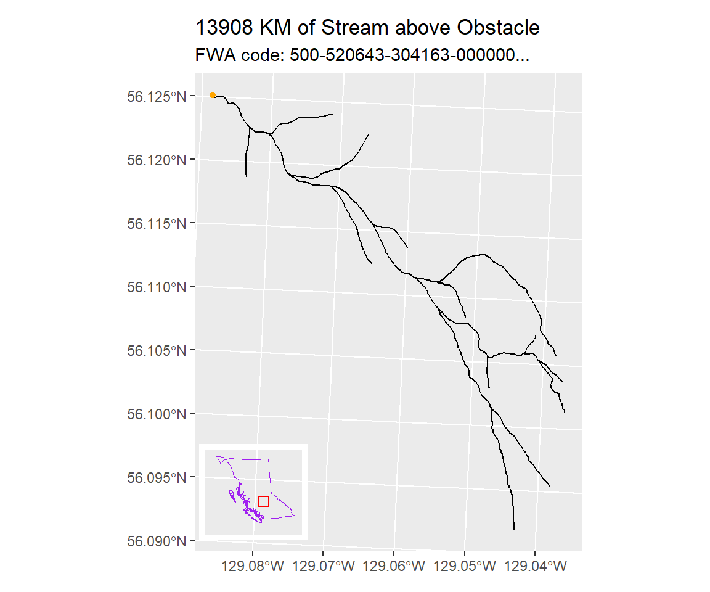
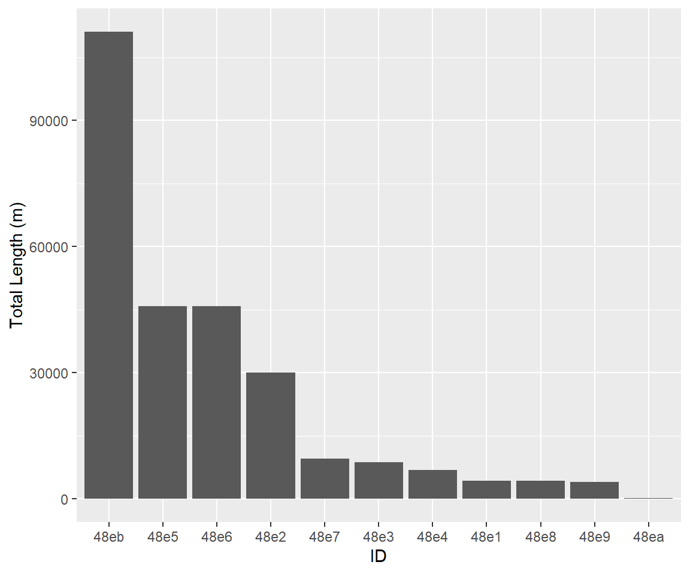

<!-- README.md is generated from README.Rmd. Please edit that file -->

# fwa.connect

<!-- badges: start -->

[](https://lifecycle.r-lib.org/articles/stages.html#experimental)
[](https://CRAN.R-project.org/package=fwa.connect)
<!-- badges: end -->

Fwa.connect is intended to help users quickly identify patterns of
connectivity between streams and lakes in the B.C. Freshwater Atlas. By
providing a two-column data.table that lists up- and down-stream streams
(identified by the FWA_WATERSHED_CODE field), a tidygraph network
object, and some basic utility functions to work with upstream graphs of
streams, {fwa.connect} will hopefully reduce workflow waiting times by
eliminating the need to download the entirety of the Freshwater Atlas
stream network or to perform laborious spatial operations to find
connections between streams.

## Installation

You can install the development version of fwa.connect like so:

``` r
devtools::install_github('chrispmad/fwa.connect')
# or 
remotes::install_github('chrispmad/fwa.connect')
```

## Example

Let’s say we wanted to find all streams above a certain point in space,
e.g. a barrier to fish passage:

``` r
library(fwa.connect)
library(bcdata) # To access datasets in the open-source BC Data Catalogue
#> 
#> Attaching package: 'bcdata'
#> The following object is masked from 'package:stats':
#> 
#>     filter
library(sf)
#> Linking to GEOS 3.11.2, GDAL 3.7.2, PROJ 9.3.0; sf_use_s2() is TRUE
library(progress)

# Download a possible fish barrier from the PSCIS dataset.
fp = bcdc_query_geodata("pscis-assessments") |> 
  filter(RESPONSIBLE_PARTY_NAME == 'WEST FRASER MILLS LTD.',
         STREAM_NAME == 'Nass River',
         ROAD_NAME == 'Warren Road') |>
  collect()

# Find the nearest stream within 50 meters.
stream = fwa.connect::find_nearest_stream(fp, max_buffer_dist = 50)

# Calculate the summed length of all streams upstream from a point (or a FWA code)
upstream_l = fwa.connect::estimate_total_upstream_length(obstacles = fp,
                                            make_plot = T,
                                            save_plot = F)
#> 1 point to assess...
#> bc_bound_hres was updated on 2023-04-11
```



``` r

knitr::kable(
  upstream_l 
)
```

| total_length_m | id                                                           | search_outcome               |
|---------------:|:-------------------------------------------------------------|:-----------------------------|
|          13908 | WHSE_FISH.PSCIS_ASSESSMENT_SVW.fid-757644df_18d4c3a3b2f_127b | stream(s) found and measured |

``` r
# Calculate the length for multiple points.
fps = bcdata::bcdc_query_geodata("pscis-assessments") |>
  bcdata::filter(ASSESSMENT_DATE > as.Date('2020-10-01') & ASSESSMENT_DATE < as.Date('2021-01-01')) |> 
  bcdata::collect()

upstream_lengths = estimate_total_upstream_length(
  obstacles = fps,
  make_plot = F,
  save_plot = F
)
#> 11 points to assess...

knitr::kable(
  upstream_lengths
)
```

| total_length_m | id                                                             | search_outcome               |
|---------------:|:---------------------------------------------------------------|:-----------------------------|
|           4386 | WHSE_FISH.PSCIS_ASSESSMENT_SVW.fid-47f43b4d_18d4c3bdbc8\_-31e8 | stream(s) found and measured |
|          30012 | WHSE_FISH.PSCIS_ASSESSMENT_SVW.fid-47f43b4d_18d4c3bdbc8\_-31e7 | stream(s) found and measured |
|           8722 | WHSE_FISH.PSCIS_ASSESSMENT_SVW.fid-47f43b4d_18d4c3bdbc8\_-31e6 | stream(s) found and measured |
|           6834 | WHSE_FISH.PSCIS_ASSESSMENT_SVW.fid-47f43b4d_18d4c3bdbc8\_-31e5 | stream(s) found and measured |
|          45787 | WHSE_FISH.PSCIS_ASSESSMENT_SVW.fid-47f43b4d_18d4c3bdbc8\_-31e4 | stream(s) found and measured |
|          45787 | WHSE_FISH.PSCIS_ASSESSMENT_SVW.fid-47f43b4d_18d4c3bdbc8\_-31e3 | stream(s) found and measured |
|           9512 | WHSE_FISH.PSCIS_ASSESSMENT_SVW.fid-47f43b4d_18d4c3bdbc8\_-31e2 | stream(s) found and measured |
|           4272 | WHSE_FISH.PSCIS_ASSESSMENT_SVW.fid-47f43b4d_18d4c3bdbc8\_-31e1 | stream(s) found and measured |
|           4028 | WHSE_FISH.PSCIS_ASSESSMENT_SVW.fid-47f43b4d_18d4c3bdbc8\_-31e0 | stream(s) found and measured |
|            153 | WHSE_FISH.PSCIS_ASSESSMENT_SVW.fid-47f43b4d_18d4c3bdbc8\_-31df | stream(s) found and measured |
|         111073 | WHSE_FISH.PSCIS_ASSESSMENT_SVW.fid-47f43b4d_18d4c3bdbc8\_-31de | stream(s) found and measured |

``` r
p = upstream_lengths |> 
  dplyr::mutate(id_label = stringr::str_extract(id, '.{4}$')) |> 
  ggplot2::ggplot() + 
  ggplot2::geom_col(ggplot2::aes(
    x = reorder(id_label, -total_length_m), 
    y = total_length_m,
    label = total_length_m)) + 
  ggplot2::labs(y = 'Total Length (m)',
                x = 'ID')

p
```


